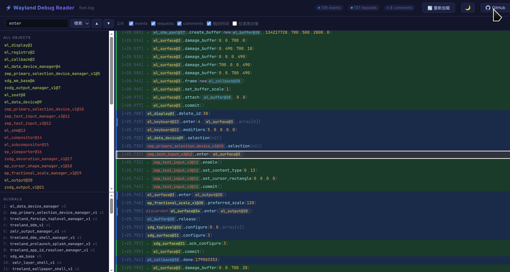
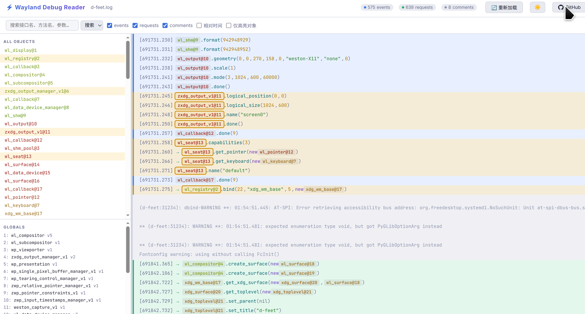

# Wayland Debug Reader

A browser-based viewer for Wayland protocol debug logs.

**🌐 Live demo: [dwapp.github.io/wayland-debug-reader](https://dwapp.github.io/wayland-debug-reader/)**




## Features

- **Drag & drop** a log file, or use the file picker, or paste text directly
- **Dual-theme support** — switch between Dark and Light modes (persists in browser)
- Color-coded log lines — events (blue), requests (green), comments (gray)
- **Left sidebar** shows all live Wayland objects and bound globals
- **Object highlighting** — click any object to highlight all related lines across the log
- **Filter-only mode** — show only lines involving the selected object
- **Search** by interface name, method, or argument with navigation (Prev/Next)
- **Relative timestamps** — toggle between absolute and relative (+X.XXXs) time
- Toggle visibility of events / requests / comments independently
- Resizable sidebar

## Usage

### Capture a log

```bash
WAYLAND_DEBUG=1 <your-app> 2>&1 | tee wayland.log
```

Then open the [live demo](https://dwapp.github.io/wayland-debug-reader/) and drag `wayland.log` onto the page.

### Run locally

No build step needed — just open `index.html` directly in your browser:

```bash
firefox index.html
# or
xdg-open index.html
```

## Log format

Supports the modern `libwayland` debug format (libwayland ≥ 1.22):

```
[3373063.122] {Default Queue}  -> wl_display#1.get_registry(new id wl_registry#2)
[3373063.532] {Default Queue} wl_registry#2.global(1, "wl_compositor", 6)
```

## Project structure

| File | Description |
|------|-------------|
| `index.html` | Single-file web application (UI + rendering) |
| `wayland-debug-tools.js` | Log parser — parses raw log text into a structured state |
| `screenshots/` | Screenshots for README |
| `test/` | Sample log files for testing |

## License

GPLv3 — see [LICENSE.GPLv3](LICENSE.GPLv3).
